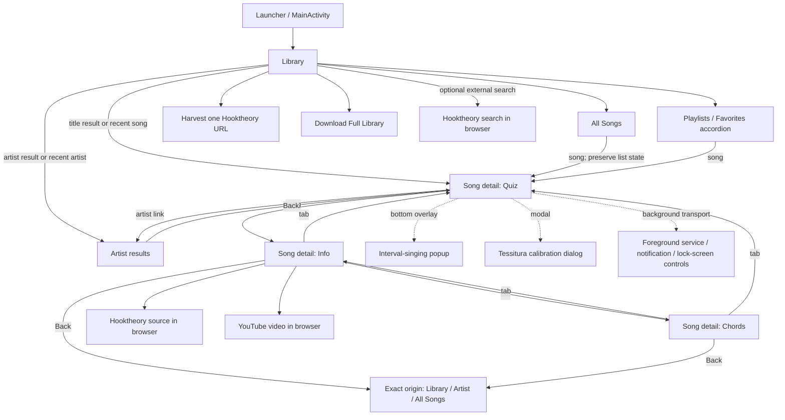

# Android application analysis for the iOS port

### Audit scope, authority, and evidence rules

This document is the behavioral and technical source of truth supporting [feature-parity.md](feature-parity.md). The reference audit pinned at `android-parity-ios-v1` was documentation-only: it changed no Android or iOS runtime behavior. The later “Current iOS implementation cross-check” is an explicitly labeled checkpoint of porting work performed after that tag. Android source remains unchanged.

The audit covered:

- Gradle settings, application build configuration, manifest, and every Android resource.
- All **52 production Kotlin files**, not only public declarations.
- All **42 local unit-test files** containing **283 `@Test` methods** and all **8 instrumented-test files** containing **26 `@Test` methods**.
- Room entities, DAOs, migrations, raw compatibility SQL, SharedPreferences keys, network/import paths, cache/staging files, services, permissions, lifecycle hooks, gestures, accessibility semantics, hardcoded values, experimental APIs, and production logging.
- Shared catalog contracts and parity fixtures as corroboration, plus existing architecture/documentation context.
- The complete iOS shell as it existed at the reference tag, followed by a current implementation/test cross-check.

Production-source coverage is complete across these groups:

| Area | Kotlin files audited |
| --- | --- |
| Entry point and Compose UI | `AllSongsView`, `AudiationPitchPractice`, `DoubleTapHint`, `HummingIntervalPopup`, `MainActivity`, `PlaylistsSection`, `QuizDial`, `RootIntervalPreview`, `TessituraControl`, `TripleClickable` |
| Audio and transport | `AppAudioOutput`, `AudioEngine`, `AudioPitchAdapter`, `QuizPlaybackController`, `QuizPlaybackEngine`, `QuizPlaybackService`, `QuizPlaybackTiming`, `SynthVoice` |
| Microphone and vocal practice | `ComfortablePitchCapture`, `MicrophonePitchCoordinator`, `MicrophonePitchTracker`, `PersistentQuizPitchPractice`, `PitchDetector`, `PitchSmoother`, `PitchSource`, `SingingTargets`, `SpelledInterval`, `TessituraResolver`, `TessituraSessionViewModel` |
| Theory, event derivation, and rendering | `ChordInterpreter`, `MusicTheory`, `QuizIntervalState`, `RelativeIonianContext`, `RomanNumeralLayout`, `RomanNumeralRenderer`, `ScaleDegreeRenderer`, `SectionOrder` |
| Catalog, network, and payloads | `AppDatabase`, `DataExtractor`, `DataUtils`, `DatabaseDownloader`, `HarvestService`, `HooktheoryDataCompat`, `HooktheoryModels`, `Scraper`, `Song`, `SongBrowse`, `SongDao` |
| User data and history | `HistoryManager`, `Playlist`, `PlaylistDao`, `UserDataDatabase` |

Evidence labels used here:

- **Verified** means directly supported by repository code, configuration, or a test inspected in this audit.
- **Inference** means a porting recommendation or likely platform mapping derived from verified behavior; it is not a claim that the repository already implements it.
- **Open** means product or release intent cannot be established from code and requires a decision.

Unless a statement is explicitly labeled **Inference** or **Open**, it is a verified repository fact. Android code takes precedence over web behavior or old prose when they disagree. Web parity fixtures are used only where Android tests consume them; web-only features are not included in the Android inventory.

## 1. Executive summary

The Android app is a single-activity Jetpack Compose application whose visible surface is much larger than its modest project structure suggests. `MainActivity.kt` is both the navigation coordinator and the principal screen implementation. It directly composes Room DAOs, preferences, coroutines, network maintenance operations, preview synthesis, a process-wide quiz transport, microphone owners, and a foreground media service.

The authoritative parity checklist contains **55 observable or independently meaningful capabilities**. iOS v1 targets **52**; dormant F013, backend-only F052, and unused F055 are Deferred:

| Group | IDs | Count |
| --- | --- | ---: |
| Catalog and library | F001–F013 | 13 |
| Song details and music theory | F014–F024 | 11 |
| Playback and quiz | F025–F039 | 15 |
| Microphone and vocal practice | F040–F049 | 10 |
| User data, maintenance, and platform integration | F050–F055 | 6 |
| **Total** | **F001–F055** | **55** |

The dominant architecture patterns are:

1. **Single-activity, hand-managed navigation.** There is no Navigation component, Fragment graph, or route model. Parent page, selected song/artist, selected tab, and overlay state are Compose state.
2. **Large Compose state coordinator.** Most state lives in `remember`/`rememberSaveable` in `MainScreen`; `TessituraSessionViewModel` is the only lifecycle `ViewModel`.
3. **Replaceable catalog plus durable user store.** Two Room databases deliberately isolate downloadable catalog data from playlists.
4. **Repository-light data access.** Compose code calls DAOs and service objects directly; the iOS `CatalogRepository` protocol is a useful boundary not present as a corresponding Android abstraction.
5. **Process-wide real-time media.** `AppAudioOutput`, `AudioEngine`, and `QuizPlaybackController` are global objects. The streaming engine owns its worker and `AudioTrack`; the foreground service supplies system media integration.
6. **Exclusive microphone coordination.** One `MicrophonePitchCoordinator` arbitrates the quiz persistent listener, interval-singing tool, and tessitura calibration.
7. **Pure domain kernels surrounded by platform-native edges.** Theory, interval, timing, tessitura, and much scoring logic can be ported structurally; Canvas, Room, AudioTrack, AudioRecord, MediaSession, and Android permissions cannot.

At the `android-parity-ios-v1` reference tag, the iOS app was only a source-verified shell: `NavigationStack`, an intentionally empty `CatalogRepository`, and a minimal tested SwiftData `PlaylistRecord`. The post-tag implementation checkpoint in section 14 records the native catalog/domain/audio/user-data and vertical-slice work now present; remaining gaps are intentionally tracked as Partial/Not started rather than rewriting the Android baseline description.

## 2. Application purpose

Acquiring is an offline-capable music-theory, ear-training, and vocal-practice application built around a downloadable Hooktheory-derived song catalog. A user discovers a song by title, artist, grouped library browsing, recent history, or playlist; selects a section; studies metadata and chords; then uses a synchronized quiz to hear, identify, preview, and sing melody notes, chord roots, chord tones, and intervals.

The app is not a general streaming player: playback is locally synthesized from decoded theory events. Its product-defining loop is **find a real song → choose a section → inspect its harmony → loop and manipulate a synthesized quiz timeline → preview or sing specific musical targets**. Favorites and history support return use. Manual harvest and full-catalog replacement maintain the local corpus, while background media controls let section playback continue outside the foreground UI.

## 3. Repository structure

| Path | Role in this audit |
| --- | --- |
| `android/app/src/main` | Authoritative Android manifest, resources, and 52 production Kotlin files. |
| `android/app/src/test` | 42 host-side unit/Robolectric test files and shared-fixture consumers. |
| `android/app/src/androidTest` | 8 device/emulator instrumentation test files. |
| `android/app/build.gradle`, `android/build.gradle`, `android/settings.gradle` | Android toolchain, dependencies, SDK levels, source sets, and test configuration. |
| `android/scripts` | Repository check wrappers, including `compact_check.py`. |
| `ios` | Current SwiftUI/SwiftData shell, Xcode project, unit tests, and UI tests. |
| `contracts/catalog` | Cross-platform catalog validation requirements that corroborate Android downloader behavior. |
| `contracts/fixtures` | Shared theory/parity data consumed by tests. |
| `docs` | Architecture, issue, oracle, and historical context; code overrides stale prose. |
| `web` and `tooling` | Corroborating implementations/research/export tooling only; web-only features are excluded from this inventory. |
| `.github/workflows` | Repository automation context; not an application runtime feature. |

### Build configuration

| Item | Verified Android value | Port consequence |
| --- | --- | --- |
| Namespace/application ID | `com.acquiring.android` | Choose an independent iOS bundle identifier; no cross-platform identifier contract is encoded. |
| App version | version code 1, version name 1.0 | Release numbering policy is not otherwise documented. |
| SDKs | minimum 26; target/compile 34 | Android supports API 26+. This does not determine the iOS deployment target. |
| Language/toolchain | Java/Kotlin JVM 17; Kotlin 2.2.10 | Pure Kotlin logic must be translated or moved into an explicitly chosen shared layer; none exists today. |
| Android build plugin | AGP 9.3.1 | Android-only build detail. |
| UI | Compose plugin 2.2.10; Compose BOM 2023.06.01; Material 3 | SwiftUI is the natural iOS UI mapping, but behavior must be decomposed from `MainActivity.kt`. |
| Build types | release plus implicit debug; release minification disabled | No flavor-specific endpoints or feature flags were found. |
| Tests | JUnit/Robolectric/local resources plus Compose/Espresso instrumentation | Shared fixtures are already exposed to Android unit tests through `sourceSets.test.resources`. |

Production libraries are AndroidX Core, Lifecycle Runtime/ViewModel, Activity Compose, Compose UI/Material 3, Room runtime/KTX/compiler 2.8.4, coroutines Android/core 1.11.0, OkHttp 4.11.0, jsoup 1.16.1, and kotlinx.serialization JSON 1.5.1. No dependency-injection framework, navigation framework, analytics, crash reporting, authentication, billing, native/JNI code, WorkManager, or image-loading library is configured.

### Manifest and components

| Declaration | Behavior |
| --- | --- |
| `INTERNET` | Catalog download, Hooktheory page/API harvesting, and external browser handoffs. |
| `RECORD_AUDIO` | Pitch detection, interval singing, persistent quiz practice, and tessitura calibration. Requested just in time, not at launch. |
| `FOREGROUND_SERVICE` and `FOREGROUND_SERVICE_MEDIA_PLAYBACK` | Keeps quiz section playback reachable while backgrounded or screen-off. |
| `POST_NOTIFICATIONS` | Requested by `MainActivity` on API 33+ when denied. Playback code can continue without a visible notification, subject to platform policy. |
| `MainActivity` | Exported launcher activity; soft keyboard initially hidden. No deep links. |
| `QuizPlaybackService` | Non-exported `mediaPlayback` foreground service with a `MEDIA_BUTTON` intent filter. |
| Application flags | Backup enabled, audio playback capture allowed, RTL enabled, dark no-action-bar theme. |

No providers, static broadcast receivers, app widgets, jobs, workers, secondary activities, or deep-link intent filters were found. The service registers its becoming-noisy receiver dynamically.

Resources are deliberately small: adaptive/legacy/round/monochrome launcher assets, a notification icon, an outlined-star vector, colors, application strings, and the dark Material theme. Most user-facing strings, dimensions, and styling are declared directly in Compose rather than resource-qualified for locale or device class.

## 4. Architecture

`MainActivity.onCreate` initializes shared audio output, the process-wide quiz controller, the catalog Room database, and the user-data Room database, then installs a dark Compose theme and enters `MainScreen`. It also asks for notification permission on API 33+ when needed.

The principal data paths are:

1. **Catalog read:** Compose launches a coroutine → `SongDao` query → scalar `Song` or `SongBrowseRow` → `DataUtils` decompresses/decodes `dataBlob` only after selection → `HooktheoryDataCompat` repairs legacy JSON → screens derive theory/timing/card state.
2. **Catalog replacement:** UI invokes `DatabaseDownloader` → OkHttp downloads gzip to cache → decompression creates a sibling staging database → schema/backfill/validation run → the live Room database is closed → sidecars are removed → staged file replaces the live file atomically when supported, with backup recovery otherwise → Room is reopened by the caller.
3. **Manual harvest:** Hooktheory URL → jsoup page extraction → ordered public API requests → `DataExtractor` → encoded section map → Room transaction upserts song plus browse metadata/modes.
4. **Preview audio:** UI derives MIDI/frequencies/voicings → `AudioEngine` renders PCM using `SynthVoice` → a static `AudioTrack` plays on an exclusive preview channel → fades/tokens cancel superseded previews.
5. **Section transport:** selected section builds `QuizTimeline` and `QuizPlaybackConfig` → `QuizPlaybackController` delegates commands to `QuizPlaybackEngine` → a worker renders bounded blocks into a streaming `AudioTrack` → state flows back to Compose and `QuizPlaybackService` mirrors now-playing/controls.
6. **Pitch input:** a feature acquires an owner lease from `MicrophonePitchCoordinator` → `MicrophonePitchTracker` reads mono PCM → YIN plus gates/smoothing emits `PitchResult` → vocal/tessitura controllers derive display, progress, or scoring state.
7. **User data:** Favorites/playlist actions write `acquiring-user-db`; Library observes playlist summaries and memberships; song slugs are resolved against the separate catalog when displayed.

### State lifetime

| Lifetime | Examples | Port implication |
| --- | --- | --- |
| Recomposition/local screen | open menus, transient errors, current suggestions, popup expansion | SwiftUI view state is sufficient if route boundaries are explicit. |
| Saved Compose state | All Songs sort/filter/expanded group/scroll restoration; external-search checkbox; play-button fractions; All Songs visibility | Must decide what survives view recreation versus process termination on iOS. |
| Activity configuration via `ViewModel` | tessitura anchor and continuity state | `TessituraSessionViewModel` survives Android configuration change, not process death. |
| Process-wide singleton | preview channels, quiz transport/engine, audio session identity | Keep transport/audio ownership outside individual SwiftUI views. |
| Durable Room | catalog; playlists and membership | Maintain the catalog/user-store split. |
| Durable SharedPreferences | recent song slugs and artists | `UserDefaults` is a direct iOS mapping. |

Transpose, waveform, quiz tempo, arpeggiation, volume balance, current song/tab/section, microphone sessions, and tessitura anchor are not durable across process death. The catalog and playlist data are durable. Playback is designed to outlive a particular composable, not the application process.

## 5. Navigation and screen map

The graph below describes audited behavior, not a proposed iOS information architecture.

Opening a valid song enters **Quiz**, not Info. Back from Quiz changes to Info; a subsequent Back from Info or Chords returns to the recorded parent. Android system Back uses the same rule. Opening from All Songs preserves list controls and scroll. The interval-singing tool remains a bottom overlay within song detail; lifecycle/background handling can collapse and clear it. Tessitura calibration is a modal, non-dismissable capture flow with an explicit Cancel action.

There is no separate onboarding, settings, account, help, or tab-bar root. There are no inbound routes.

## 6. Feature inventory

| Surface | Entry and observable behavior | Empty/error/lifecycle behavior | Feature IDs |
| --- | --- | --- | --- |
| Library | Title search, artist search, All Songs, playlist accordion, individual harvest, full-library download | Shows operation status and errors; search results may be empty | F001–F013, F050–F053 |
| Title suggestions/results | 300 ms debounce, 20-row pages, incremental paging; recents appear only when focused with a blank query; explicit Search produces cards | Blank/no matches and query errors are rendered in the screen | F002–F003 |
| Artist suggestions/results | Paged suggestions and recent artists; selecting opens an artist page of playable songs | Unknown artist fallback; empty result is representable | F004 |
| Hooktheory search option | Checkbox enables external search and browser launch | Browser capability/failure is delegated to Android URI handling | F005 |
| All Songs | Alphabetical, complexity, and seven-mode grouping; one heading expanded at a time; sticky headings/counts; 250 ms local fuzzy filter | Loading, query error, no rows, no filter matches, and missing legacy metadata warning | F006–F009 |
| Playlists/Favorites | Collapsible playlist summaries and counts; newest-added songs; star/remove action | Catalog-missing slugs are omitted until resolvable; persistence failures roll back optimistic favorite state | F050–F052 |
| Artist results | Back, artist title, vertically listed songs | Falls back to `Unknown Artist`, `Unknown Title` labels | F004, F014 |
| Song header/tabs | Clickable artist, favorite star, Lock in Major, key/scale, section selection; Info/Chords/Quiz navigation | Opening another song clears tessitura state; invalid/missing payload surfaces load failure | F010, F014–F015, F037, F050 |
| Info | Overview metrics, progression pills, key/tempo/meter changes, source IDs/slug, Hooktheory and YouTube links | Defaults include C major, 120 BPM, and safe empty metadata where source fields are absent | F016–F017 |
| Chords | Unique chords in adaptive grid; Roman/letter toggle; arpeggiate toggle and speed selector; tap preview | Rest/blank chords are excluded; unknown/partial notation is handled by interpreter fallbacks | F018–F024 |
| Quiz: Full | Timeline, playhead, cards, transport, transpose, waveform, tempo, arpeggiation, mix, section, tessitura, Lock in Major | Rests/gaps retain layout; missing playable data can fall back to metadata end beat | F025, F027–F039 |
| Quiz: Simple | Root-only controls and interval slider; no full timeline, melody card, or chord-tone row | Interval state has explicit unavailable/rest paths | F026, F029–F037 |
| Timeline gestures | Tap seek; drag scrub; inertial continuation; transport pauses/resumes around scrub | Bounds stop inertia; prior requested play state controls resume | F028 |
| Card gestures | Single tap preview, double tap sing-back request, long press persistent pitch; semantics describe these gestures | Preview channels cancel prior requests; production cards do not install the unused helper's explicit custom multi-tap actions | F035–F036, F042, F046, F054 |
| Interval-singing popup | Collapsed strip or expanded two-slot capture; manual recording, target-guided listening, exact-pitch playback, Flip-Flop | Permission wait, no signal, tracker error, cancellation, background clearing | F041–F045 |
| Tessitura dialog | Permission, wait, three-second steady-hum capture, progress, retry/error, Cancel | Silence does not count; dropout grace and restart rules are explicit | F041, F048–F049 |
| Background media surface | MediaStyle notification, MediaSession, play/pause/stop, seek/skip, app reopen, headset controls | Notification denial is nonfatal in code; audio focus/route changes pause or duck | F027, F039 |
| External browser | Hooktheory search, song source, and YouTube video | No in-app web view or deep-link return contract | F005, F017 |

Selectors and menus embedded in these screens include title/artist suggestion dropdowns, All Songs sort/group controls, section pickers, waveform picker, transpose picker, tempo control, arpeggiation options, display-name toggle, chord arpeggiate toggle/speed picker, and the playlist accordion. They are not separate routes.

Reusable UI units include the All Songs and Playlists surfaces, Roman-numeral and scale-degree painters, `QuizDial`, root-interval preview, tessitura control/dialog, interval-singing popup, double-tap hint, and the active-event/card derivation helpers. Their state ownership is still largely coordinated by `MainScreen`/`QuizTab` rather than isolated feature models.

The following narratives capture behavior that is too stateful or interdependent to express safely as one-line parity rows.

### Catalog and discovery

Title and artist search use DAO queries rather than loading all songs. Suggestions debounce user input and page in chunks of 20. Recent title suggestions store only slugs, then resolve them through the current catalog; recent artist strings are separately canonicalized by replacing hyphens with spaces, trimming, and deduplicating case-insensitively. Both histories retain at most ten items.

Search and browse queries require `dataBlob IS NOT NULL`. This is important: the `MainActivity` branch that harvests a selected song whose blob is null is defensive production code, but the normal Library, artist, and All Songs entry paths do not expose such a row. It is classified Dormant (F013), not Complete user-visible behavior.

All Songs deliberately uses `song_browse_entries` rather than fetching `Song.dataBlob`. Alphabetical groups are A–Z, 0–9, then `#`. Complexity is ten 10-point buckets with 100 included in the final bucket, plus Unrated. Mode groups are Ionian/Major, Dorian, Phrygian, Lydian, Mixolydian, Aeolian/minor, and Locrian. The fuzzy filter lowercases and removes spaces, hyphens, and underscores from both query and title/artist. Legacy catalogs can have scalar browse rows but no rating or mode memberships; the UI warns rather than pretending those sort modes are populated.

### Song loading and sections

`Song.dataBlob` is UTF-8 JSON representing `Map<String, ExtractedSection>`, normally gzip-compressed. `DataUtils` attempts gzip decoding and falls back to raw bytes. `HooktheoryDataCompat` then applies the repository's legacy payload repair before decode/use. Manual harvesting currently stores raw encoded JSON even though the entity comment calls the field compressed; the raw fallback therefore remains required.

Sections are ordered by explicit `sectionIndex` when present and otherwise by canonical section-name rules with a stable unknown-section fallback. Page scraping preserves the source page order and duplicates; harvest assigns unique map keys rather than overwriting repeated section names.

Opening a song selects the first canonical section and enters Quiz. The Info and Chords tabs share the full song header; Quiz intentionally changes the header/layout and hides the ordinary tab row.

### Info and Chords

Info computes the first key, BPM, meter, duration, beat/bar totals, total/unique chord counts, and sounded/total melody-note counts. It explicitly identifies chord-only content. It lists key, tempo, and meter changes, section/source identifiers, the catalog slug, progression chord pills, and external Hooktheory/YouTube actions. Tapping a progression pill previews its interpreted voicing.

Chords deduplicates the section's displayable chords and renders them adaptively. The user can switch Roman numerals to letter names, enable block-versus-arpeggiated preview, and choose a 30–1000 ms arpeggio step. The display and audio both depend on the active key at the chord's beat, not only the section's initial key.

### Theory and renderers

`MusicTheory` supplies scale intervals, pitch classes, MIDI/frequency conversion, transposition, key parsing, note naming, accidentals, and scale-degree operations. `ChordInterpreter` handles Hooktheory chord JSON, inversions, omissions/additions/alterations, applied and borrowed harmony, Roman symbols, letter names, pitch-class sets, scale degrees, and playable voicings. Shared fixtures test Android output against the established corpus but do not supersede Android code.

Roman numerals are not plain text. `RomanNumeralTokenizer` and `RomanNumeralPainter` lay out base numerals, stacked figured bass, diminished/quality marks, suffix clusters, applied denominators, and borrowed-harmony rows while fitting available bounds. `ScaleDegreePainter` similarly fits accidentals, numerals, and a vector-drawn hat. Both use Android Canvas/Paint/Typeface and need native iOS implementations with golden/semantic tests.

### Quiz transport and controls

Full mode draws melody and chord lanes around a fixed center playhead, tracks the key active at the current beat, and derives previous/current melody, interval, chord, and chord-tone cards. It supports tap seek, drag scrub, inertial continuation, and pause/resume around manipulation. Simple mode hides the timeline, melody row, and chord-tone row; it exposes previous/current root interval behavior and a slider.

Transport loops the selected section. Its end is calculated from audible melody/chord event ends with metadata as fallback, preventing declared-but-silent tail data from dominating when playable data exists. Section switches rebuild the timeline while carrying the user's requested playing/paused state.

Controls are:

- Tempo from 0–200 percent.
- Transpose from -12 through +12 semitones in Full mode.
- Ten timbres: sine, square, sawtooth, triangle, strings, electric piano, warm organ, marimba, vibraphone, and nylon guitar.
- Chord arpeggiation choices labeled 1/4, 1/3, 1/2, off, 1, 2, 3, and 4, encoded as cycles per beat by `QuizArpeggioOption`.
- Independent melody/chord balance through a custom vertical dial.
- Full/Root-only mode, section picker, reset, and a draggable play/pause button whose normalized position is saved.
- Lock in Major, which maps modal context into relative Ionian for labels/rendering without rewriting source data.

Card previews use the song's base BPM; transport tempo does not retime them. Global transpose is applied once. Exact-frequency playback of a captured human pitch intentionally bypasses musical transposition. A preview or sing-back target can pause section transport, and exclusive preview channels fade/cancel superseded playback.

## 7. Data and persistence

| Dataset | Location | Written when | Read when | iOS equivalent needed? |
| --- | --- | --- | --- | --- |
| Song catalog and section payloads | Room/SQLite file `acquiring-db` | Full-catalog install, Room migration/compatibility, or individual harvest | Search, grouped browse, artist/playlist resolution, and song detail load | Yes; compatible SQLite access and safe replacement are core parity requirements. |
| Playlists and memberships | Room/SQLite file `acquiring-user-db` | Favorites toggle and DAO-supported playlist operations | Library summaries, counts, playlist expansion, favorite state | Yes; SwiftData may be suitable if cross-store slug semantics and migrations are explicit. |
| Search history | SharedPreferences file `search_history` | Successful song/artist selections | Focused blank-query suggestions | Yes; `UserDefaults` is sufficient. |
| Download/staging artifacts | Cache and database directories | During full-catalog update | Only during validation/install/recovery | Yes as transient files; they must not be backed up or treated as user data. |
| Compose/ViewModel/audio state | Memory/process only | During interaction/playback/calibration | Current UI, transport, and vocal workflows | Yes behaviorally, but not as durable storage unless product requirements change. |

There is no user-data import/export format. The only imports are the visible catalog download and single-song harvest maintenance paths; the app does not export playlists, history, recordings, or analysis results.

### Catalog Room database

File: `acquiring-db`. Room schema version: 3.

| Table | Columns and keys | Purpose |
| --- | --- | --- |
| `songs` | `slug TEXT` primary key; nullable `artist`, `title`; non-null `url`, `status`; nullable `dataBlob BLOB` | Canonical catalog row and complete section payload. Default status for constructed rows is `pending`. |
| `song_browse_entries` | `slug TEXT` primary key; nullable `artist`, `title`, `complexityRating`, `complexityBucket`; non-null `alphaGroup` | Lightweight browse/search metadata without loading the blob. Indexes on `alphaGroup` and `complexityBucket`. |
| `song_browse_modes` | composite primary key (`slug`, `mode`) | Many-to-many mode membership. Index on `mode`. |

Migration 1→2 creates both browse tables and indexes, then backfills scalar fields only for songs with non-null payloads. It does not parse blobs to invent complexity/mode metadata. Migration 2→3 normalizes `alphaGroup` from trimmed title into A–Z, 0–9, or `#`.

`SongDao` provides direct lookup, paged title/artist suggestions, artist/song results, recent-slug resolution, grouped browse counts/rows, metadata status, and transactional upsert helpers. Some helpers such as existence/count methods are currently exercised only by tests or maintenance paths; their presence is not a separate user feature.

### User Room database

File: `acquiring-user-db`. Room schema version: 1.

| Table | Columns and keys | Purpose |
| --- | --- | --- |
| `playlists` | `id TEXT` primary key; `name TEXT`; `isBuiltIn INTEGER`; `createdAt INTEGER` | Playlist identity. Built-in Favorites uses id `favorites`. |
| `playlist_entries` | composite primary key (`playlistId`, `slug`); `addedAt INTEGER` | Catalog-slug membership. Foreign key to playlist with cascade delete; index on `playlistId`. |

There is intentionally no foreign key from a playlist entry to the catalog because SQLite cannot enforce one across the two files. Missing catalog slugs remain durable user data but are omitted from rendered playlist songs until the current catalog can resolve them. Catalog replacement closes/replaces only `acquiring-db`; it must never rebuild or delete `acquiring-user-db`.

The DAO seeds Favorites when needed, toggles membership, returns summaries/counts, lists newest-added slugs, and supports custom-playlist insertion/deletion. The Android UI only exposes Favorites and browsing/removal from existing playlists. There is no production create, rename, or delete workflow for a custom playlist, so that backend is Partial (F052).

### Non-entity model inventory

| Model family | Principal types and purpose |
| --- | --- |
| Hooktheory transport | `HooktheoryApiResult`, `Scraper.SectionRef`, `Scraper.PageExtraction`, and `DataExtractor` represent page/API input and extraction. |
| Decoded song | `ExtractedSection`, `KeyInfoWithBeat`, `KeyInfo`, and `MelodyNote`; section metadata retains JSON arrays/objects for chords, notes, keys, tempos, meters, sections, YouTube, and end-beat-like fields. |
| Browse UI | `SongBrowseRow`, `SongBrowseGroupCount`, `SongBrowseMetadataStatus`, `AllSongsSortMode`, `AllSongsGroup`, `DiatonicMode`, and `AllSongsRuntimeState`. |
| Theory/display | resolved chord-root types, Roman numeral parts/displays/placements, scale-degree labels/measurements, relative-Ionian degree, quiz key display, and spelled pitch/interval/direction types. |
| Playback | waveform/channel/token types; `QuizTimelineEvent`, `QuizTimeline`, `QuizPlaybackConfig`, `QuizPlaybackState`, `QuizNowPlaying`, phase/layer/chord-mode enums, and renderer/sink records. |
| Quiz derivation | root/melody interval states, active-event index, pitch-card roles/positions/display modes, and root preview steps. |
| Vocal practice | `SingingTargetNote`, `SingingTargetRequest`, pitch results, smoothing/tracking modes, comfortable-pitch progress, persistent target/run/score/phase records, tessitura calibration state, and popup pitch data. |
| Experimental audiation | `AudiationTarget` and `AudiationState`; compiled and tested but not called by production UI. |

`HooktheorySongData` is declared as a serializable aggregate but no production use was found. Most production decoding operates through `HooktheoryApiResult`, `ExtractedSection`, and JSON elements.

### SharedPreferences

Preference file `search_history` contains exactly these audited keys:

| Key | Encoding | Rule |
| --- | --- | --- |
| `recent_slugs` | comma-separated string | Most recent first, de-duplicated, maximum 10. Slugs are assumed not to contain commas. |
| `recent_artists` | kotlinx-serialized JSON string array | Hyphens become spaces, values are trimmed, case-insensitively de-duplicated, maximum 10. Malformed JSON yields an empty list. |

No other `SharedPreferences` persistence was found.

## 8. Networking and external services

### Song payload and Hooktheory responses

The song blob logically encodes a map of unique section keys to `ExtractedSection`. Each section may contain `songId`, `numericId`, `sectionName`, `sectionIndex`, `songInfo`, chord JSON objects, notes JSON, and metadata JSON. The API response model accepts `ID` as arbitrary JSON, `song`, optional `artist`, `section`, `jsonData`, and `xmlData`; the current endpoint requests only `ID,song,section,jsonData`. Extraction is lenient and ignores unknown JSON keys.

Individual harvesting accepts a Hooktheory page URL, scrapes its section references, then calls:

`https://api.hooktheory.com/v1/songs/public/{id}?fields=ID,song,section,jsonData`

No authorization header, credential, API key, or secret store is used. The harvested section map is currently written as uncompressed UTF-8 JSON. Load compatibility therefore must continue to accept both gzip and raw JSON unless the database is migrated.

### Full catalog artifact

The downloader is hardcoded to:

`https://github.com/briansgithub/acquiring/releases/download/v1.0.0-data/catalog.db.gz`

It reports `56.6 MB` in status text and requires at least **40,609** songs and **40,609** browse rows. Files involved are:

| File | Location/role |
| --- | --- |
| `catalog.db.gz` | Application cache; temporary download. |
| `acquiring-db.installing` | Database directory; decompressed/validated staging file. |
| `acquiring-db` | Live Room catalog. |
| `acquiring-db.backup` | Same directory; recovery copy when replacement is not atomically advertised or during fallback. |
| SQLite `-wal`/`-shm`/`-journal` sidecars | Deleted with corresponding catalog/stage/backup file as appropriate. |

Before replacing the live database, the downloader:

1. Ensures compatibility browse tables/indexes exist and performs scalar backfill if needed.
2. Opens the stage through SQLite and checks Room-required tables/columns/indexes.
3. Requires `PRAGMA quick_check` to return `ok`.
4. Verifies minimum song and browse-entry counts.
5. Verifies every browse entry joins to a song with a non-null chord payload.
6. Closes the current Room instance only after the candidate is validated.
7. Attempts atomic move, otherwise retains and can restore a backup.
8. Cleans temporary/cache/stage/backup files on success or error as encoded by the recovery path.

The shared `contracts/catalog/` documentation corroborates these invariants. The hardcoded URL, display size, and thresholds are configuration risks, not secrets.

## 9. Permissions and platform integrations

### Audio synthesis and system-media integration

`AppAudioOutput` establishes one application audio-session identity and preferred device output sample rate. Preview and streaming tracks consume those values; tests verify fallback behavior when Android audio services are unavailable.

`SynthVoice` generates the ten selectable timbres. `AudioEngine` renders finite static PCM previews with a 30-second maximum, envelope fades, cancellation generations/tokens, prepared playback, exact-frequency playback, and three logical channels so unrelated interactions can be managed without uncontrolled overlap. It uses static-mode `AudioTrack` instances.

`QuizPcmRenderer` converts a timeline/config into bounded PCM blocks. `QuizPlaybackEngine` owns a command channel, worker, playback clock segments, active event voices, partial-write handling, attack/release behavior, loop seams, gain smoothing, and configuration crossfades. The streaming sink recovers once from `ERROR_DEAD_OBJECT`; it can grow its target buffer after underruns and exposes an Error phase if it cannot continue. Audio-focused tests inspect clipping, slew, loop seams, fades, gain behavior, arpeggiation, waveform performance, and renderer state.

`QuizPlaybackController` is a process-wide facade. It holds the active now-playing metadata and engine across composable creation/destruction, starts/stops the service as transport state changes, and makes section/config commands revision-aware so stale UI work cannot overwrite newer requests.

`QuizPlaybackService` provides:

- A MediaSession and MediaStyle notification with play/pause/stop actions.
- Lock-screen, notification, headset/media-button, seek, and skip command handling.
- A content intent that reopens the application.
- Audio-focus acquisition, transient-loss pause with conditional resume, permanent-loss pause, and duck handling.
- A dynamic `AUDIO_BECOMING_NOISY` receiver that pauses after output-route removal.
- `START_NOT_STICKY` restart semantics and a paused notification that can remain visible after detaching foreground state.

**Inference:** the closest iOS design is an `AVAudioSession` owned by an actor/service, an `AVAudioEngine` graph or source node for preview/transport rendering, `MPNowPlayingInfoCenter`, `MPRemoteCommandCenter`, interruption notifications, and route-change notifications. iOS has no equivalent of an Android foreground-service notification permission; background audio capability and user-visible Now Playing behavior should be designed natively while preserving transport semantics.

### Microphone DSP, interval singing, persistent practice, and tessitura

#### Capture and pitch estimation

`MicrophonePitchTracker` records mono PCM16 at 16 kHz. It prefers the UNPROCESSED source, then VOICE_RECOGNITION, then MIC. The normal analysis window is 2,048 samples with a 512-sample hop; melody-following mode uses a 1,024 window and 256 hop for lower latency. YIN searches approximately 65–1,000 Hz, then confidence and RMS gates reject weak/uncertain input. `PitchSmoother` applies median/EMA/octave-rejection behavior by tracking mode. A recent estimate can be held for about 200 ms to avoid visual flicker.

Only source/rate/window initialization diagnostics are gated by `BuildConfig.DEBUG`. Capture and initialization failures become `PitchResult.Error`; they are not silently swallowed.

`MicrophonePitchCoordinator` exposes exclusive leases for three owners: persistent quiz practice, the singing tool, and tessitura. A new valid acquisition takes the recorder from the previous owner. Release calls from stale leases do not stop a newer owner. Lifecycle code stops or pauses microphone features when the activity leaves the foreground.

#### Interval-singing popup

The popup has two pitch slots. In manual mode, double-tapping a slot records a three-second comfortable pitch. While active, it shows a live spelled pitch and cents; slot two is spelled relative to slot one. A single tap plays the exact captured frequency. After both captures, the tool reports interval name, direction, and cents and can play the first note, second note, or pair.

A quiz-card sing-back request sends a `SingingTargetRequest` to the popup. It expands, lets the preview transition settle, then begins listening after the encoded delay. Both target notes are shifted together when necessary so their interval is preserved. Target mode supplies live cents feedback. Flip-Flop alternates three-second slot captures, including a two-second pause after slot two.

#### Persistent quiz pitch practice

Long-pressing the simple root, a melody target, or a chord tone toggles a continuous practice selection. The target follows the currently active timeline event. Melody uses fast tracking. A moving marker is drawn only for pitch deviation below the feature's display bound, and melody runs accumulate settled samples into a per-run median result or an explicit unscored outcome. Starting another microphone owner ends or supersedes this session according to the coordinator contract.

#### Tessitura

Calibration requires three seconds of steady voiced input. Only the final two seconds contribute to the averaged anchor. Silence does not advance progress; a dropout up to one second preserves the attempt, while a longer gap restarts it. The modal flow represents idle, awaiting permission, capturing, and error/retry states and cannot be dismissed by tapping outside; Cancel is explicit.

The resolved tessitura anchor shifts preview and scoring targets into a comfortable window of roughly -8 to +12 semitones around the anchor while keeping musical contour and interval relationships. It does **not** transpose the song's source transport. Clearing calibration keeps quiz progress. Changing sections preserves the anchor but resets contour continuity. Leaving the song or opening a different song clears the session.

**Inference:** iOS needs real-device evaluation across built-in mic, wired/Bluetooth routes where supported, speaker leakage, interruption, and sample-rate conversion. Simulator-only verification is inadequate for F040–F049.

### Permission, lifecycle, and accessibility behavior

Notification permission is requested during activity creation on Android 13+ whenever currently denied; there is no custom rationale or permanent-denial education screen. Refusal does not block entering the app. Microphone permission is requested only when tessitura, the singing popup, or persistent practice needs it. A denial keeps the corresponding feature in its permission/error path rather than requesting at launch.

Lifecycle handling is split across Compose effects, activity back handling, process-wide controller state, service lifecycle, and microphone feature controllers. Important contracts for iOS are:

- Song/section UI can disappear while quiz transport continues through its process-level owner.
- App backgrounding stops active capture/practice behavior; interval-popup state may collapse/clear.
- Audio interruptions and route changes are transport events, not generic view events.
- Opening/leaving songs has explicit tessitura cleanup rules.
- Preview cancellation and stale asynchronous results are revision/token guarded.

Accessibility support includes content descriptions, semantic roles/state, and descriptive labels produced by custom renderers. Production quiz cards describe their single-, double-, and long-press behavior and use `combinedClickable`; however, they do not install explicit custom actions for double-tap sing-back. Those custom actions exist only in the unused `tripleClickable` helper. F054 is therefore **Partial**, and iOS must provide explicit VoiceOver actions for gesture-only practice operations. The timeline and custom dials likewise need meaningful adjustable equivalents, not merely pixel parity.

Android enables RTL at the application level, but most copy and layout live directly in Kotlin and no localized resource sets were found. The theme is dark. There are no explicit tablet/adaptive-window requirements in code. These are release-scope questions, not proof that iOS should be dark-only or phone-only.

## 10. Background behavior

Quiz section playback is the only deliberate long-running background workload. `QuizPlaybackController` owns transport outside any one composable, and `QuizPlaybackService` promotes active playback to a media foreground service. The service publishes MediaSession state and controls, responds to notification/lock-screen/headset commands, reacquires or abandons audio focus, pauses for becoming-noisy route loss, and uses `START_NOT_STICKY`. A paused notification may remain after foreground detachment; Stop tears the session down.

The microphone features are foreground-interaction tools. Lifecycle effects stop or relinquish capture when the app leaves the active state; there is no background microphone mode. Catalog download and harvest use coroutines tied to the live application/UI process. No WorkManager job, scheduled refresh, push-notification handler, background fetch, static receiver, or persistence mechanism for resuming a killed download was found.

On iOS, background audio capability may allow an active transport to continue, but it does not authorize arbitrary catalog work or microphone capture. The future implementation must treat remote commands, interruptions, route changes, scene activity, and the lifetime of its audio owner as separate concerns.

## 11. Third-party dependencies

Android framework APIs such as AudioTrack, AudioRecord, MediaSession, notifications, Canvas, and SQLite are discussed separately because they are platform integrations, not Gradle libraries.

| Category | Library/SDK | Version | Use in Android | Android-specific? | Official/direct iOS equivalent | Likely iOS replacement |
| --- | --- | --- | --- | --- | --- | --- |
| UI | Compose UI/Graphics/Material 3 | BOM 2023.06.01 | All production screens, gestures, layout, semantics | Yes | SwiftUI is Apple's native declarative UI | SwiftUI plus Core Graphics/Core Text where required |
| App/lifecycle | AndroidX Core KTX | 1.10.1 | Android conveniences and compatibility APIs | Yes | Foundation/UIKit equivalents by capability | Foundation, UIKit, SwiftUI environment |
| App/lifecycle | Lifecycle Runtime/ViewModel | 2.6.1 | lifecycle-aware work and tessitura `ViewModel` | Yes | No one-to-one type; Observation is native | Swift Observation/`ObservableObject`, actors, scene phase |
| App/lifecycle | Activity Compose | 1.7.2 | Compose host, activity results, Back behavior | Yes | No activity abstraction | SwiftUI `App`/`Scene`, `NavigationStack`, environment actions |
| Persistence | Room runtime/KTX/compiler | 2.8.4 | Catalog/user schemas, DAOs, migrations, transactions | Yes | SwiftData/Core Data are native but not Room-compatible | SQLite layer for the supplied catalog; SwiftData or SQLite for user data |
| Concurrency | kotlinx-coroutines Android/core | 1.11.0 | DAO/network/audio coordination and state flows | Android artifact plus Kotlin library | Swift structured concurrency | async/await, tasks, actors, observation/`AsyncStream` |
| Networking | OkHttp | 4.11.0 | Catalog download and Hooktheory API calls | No, but current artifact is JVM/Android | `URLSession` | `URLSession` |
| HTML parsing | jsoup | 1.16.1 | Hooktheory page/section extraction | JVM library | None dedicated in the Apple SDK | A reviewed Swift HTML parser or remove client-side harvest |
| Serialization | kotlinx-serialization JSON | 1.5.1 | Hooktheory responses, dynamic section payloads, artist history | No in concept; current code is Kotlin | `Codable`/`JSONSerialization` | `Codable` plus a JSON-value representation for dynamic fields |
| Local tests | JUnit | 4.13.2 | Unit assertions/runners | JVM | XCTest/Swift Testing | Swift Testing or XCTest |
| Local tests | Robolectric; AndroidX Test Core/Ext; coroutine test | 4.11.1; 1.5.0/1.1.5; 1.7.3 | Android/Room/lifecycle tests on host JVM | Yes | No direct combined equivalent | Swift Testing/XCTest with in-memory stores and test clocks |
| Instrumentation | Espresso; Compose UI test | 3.5.1; BOM 2023.06.01 | Device/emulator UI tests | Yes | XCUITest and accessibility APIs | XCUITest plus focused snapshot/semantic helpers |

There are no analytics, crash-reporting, authentication, billing, Bluetooth, location, cloud-sync, dependency-injection, navigation, image-loading, or third-party audio/DSP SDK dependencies to replace.

## 12. Android-specific functionality

| Android concept | Where it matters | Closest iOS concept or difference |
| --- | --- | --- |
| `ComponentActivity` plus manual Back handlers | Launch, state ownership, origin-aware song Back behavior | SwiftUI scene and explicit `NavigationStack` route model; iOS has no Android system-Back callback contract. |
| Compose `remember`/`rememberSaveable` | Screen state and partial restoration | SwiftUI state/restoration primitives; survival boundaries differ and must be chosen explicitly. |
| Room and `Context.getDatabasePath` | Two database files, migrations, swap, sidecars | Native SQLite URL/file coordination; SwiftData cannot directly open the delivered Room catalog as a model store. |
| Android `Intent.ACTION_VIEW`/URI handler | Hooktheory search/source and YouTube | SwiftUI `openURL`/UIApplication URL opening; universal-link return is not defined. |
| Foreground media service | Keeps transport system-visible/background-capable | No direct service analogue; use iOS background-audio mode with `AVAudioSession` and a process-owned engine. |
| MediaSession and MediaStyle notification | Notification, lock-screen, headset transport | `MPNowPlayingInfoCenter` and `MPRemoteCommandCenter`; iOS does not expose the same notification object. |
| `POST_NOTIFICATIONS` | Android 13+ notification-tray visibility | No direct permission mapping for Now Playing. Do not add user-notification permission unless iOS product behavior actually sends notifications. |
| Audio focus and `AUDIO_BECOMING_NOISY` receiver | Pause/resume, duck, unplug behavior | `AVAudioSession` interruption and route-change notifications; policies differ. |
| Static/streaming AudioTrack | Preview buffers and real-time quiz stream | `AVAudioEngine` player/source nodes or audio units; buffer timing and recovery are different. |
| AudioRecord source selection | UNPROCESSED → VOICE_RECOGNITION → MIC capture fallback | `AVAudioEngine.inputNode`; exact Android source modes have no direct equivalents. |
| Runtime `RECORD_AUDIO` request | Just-in-time vocal features | Microphone usage description and native record permission; denial UX must be iOS-native. |
| Canvas/Paint/Typeface | Roman numerals, scale degrees, quiz dial/timeline | SwiftUI Canvas, Core Graphics, Core Text; font metrics/glyph fallbacks will differ. |
| `BuildConfig.DEBUG` and Android Log | Capture/audio diagnostics | Swift compilation conditions and unified logging; retain privacy-aware release logging. |
| App backup/RTL/playback-capture manifest flags | Platform policy and layout behavior | iCloud backup, RTL, and audio-capture policy have different controls; review independently rather than translate flags. |

No Android Fragments, WorkManager, providers, widgets, Storage Access Framework, sensors, location, USB, Bluetooth, package-manager integrations, or JNI/native components are used.

## 13. Android → iOS technology mapping

The mapping is intentionally architectural rather than a file-by-file Kotlin translation.

| Concern | Android reference | Initial iOS boundary | Important difference |
| --- | --- | --- | --- |
| UI/navigation | Compose in `MainActivity` with stateful parent enum | SwiftUI feature views plus explicit routes/coordinators | Extract behavior before decomposing views; do not mirror the monolith. |
| Observable feature state | Compose state and one tessitura `ViewModel` | Observation/actors with explicit lifetime owners | Decide process, scene, route, and durable lifetimes separately. |
| Catalog | Replaceable Room/SQLite file | Read/query compatible SQLite repository | Preserve schema/validation and atomic-swap semantics; SwiftData is not a catalog decoder. |
| User data | Separate Room file | SwiftData or dedicated SQLite user store | Membership must reference catalog slugs by convention across stores. |
| Preferences | SharedPreferences | `UserDefaults` | Preserve exact recency/canonicalization behavior, not necessarily encoding. |
| JSON/domain | kotlinx serialization plus pure Kotlin theory | Codable/dynamic JSON plus pure Swift domain modules | Shared corpus should be the semantic contract. |
| Concurrency | Coroutines, flows, singleton controllers | structured concurrency, actors, observation streams | Audio/mic serialization should not depend on view tasks. |
| Rendering | Compose Canvas/Paint | SwiftUI Canvas/Core Graphics/Core Text | Golden images alone are insufficient; test parsed structure and accessibility labels. |
| Audio | AudioTrack plus process-wide controllers | `AVAudioSession`/`AVAudioEngine` service layer | iOS interruption/background rules differ materially. |
| Microphone | AudioRecord plus exclusive coordinator | input-node tap plus exclusive actor/lease coordinator | Calibrate DSP and latency on devices; no Android source-mode equivalence. |
| System media | Foreground service/MediaSession | Now Playing and Remote Command Center | Preserve commands/state, not Android notification mechanics. |

The existing iOS repository already establishes three useful but incomplete boundaries: SwiftUI navigation, a catalog repository protocol, and a separate SwiftData user model. They should be extended only after catalog format and user-membership decisions are explicit.

## 14. Incomplete, dead, experimental, and constrained functionality

### Error paths, fallbacks, hardcoded behavior, and known limitations

| Area | Verified handling or limitation |
| --- | --- |
| Catalog download | Reports progress/errors; validates before closing live Room; deletes sidecars; restores backup when replacement fails. URL, minimum count, and displayed size are hardcoded. |
| Catalog compatibility | Creates/backfills browse schema for older candidates; migration cannot reconstruct rating/mode metadata from blobs and UI warns. |
| Payload decode | Tries gzip then raw JSON; applies compatibility repair; malformed content can surface as a song-load error. |
| Manual harvest | Rejects invalid/unextractable pages through error results; calls public endpoint serially in page order; currently writes uncompressed JSON. Network/auth/rate-limit policy is not configurable. |
| Search/browse | Debounced asynchronous queries, paged results, explicit loading/empty/error states; selected missing-payload branch is normally unreachable. |
| Playlists | Favorites toggle is optimistic and rolls back on persistence error; missing catalog slugs are retained but hidden from the rendered list. |
| Theory | Safe defaults exist for absent keys/tempo and blank/rest chord inputs; compatibility and corpus tests exercise edge notation. Unknown source notation can still produce fallback/unknown output rather than a crash. |
| Preview audio | Generations/tokens cancel stale playback; failed `AudioTrack` preparation/start is logged and cleaned up. |
| Quiz stream | Handles partial writes and underruns; one dead-track recreation; then exposes error state. Metadata end is only a fallback when playable events do not determine duration. |
| Microphone | Source fallback order, permission states, no-signal and explicit error states, dropout rules, exclusive ownership, lifecycle stop. Device-specific accuracy remains empirical. |
| Notification/media | Notification denial is treated as nonfatal; service/platform restrictions may still vary by OS policy. |

Global searches found no production `TODO` or `FIXME` markers. The code does opt into experimental Compose Material 3, Foundation, layout, and text APIs in several screens/renderers. Production logging includes audio warnings/errors and microphone initialization details; only the microphone detail log is explicitly debug-gated. Test suites contain extensive diagnostic `println` output, which is not production behavior.

No credentials or user identity data were found. Network endpoints, catalog count, download size label, history size, debounce/page sizes, audio limits, pitch bands, tessitura windows, and timing thresholds are code constants rather than remote configuration.

### Production behavior versus incomplete, dormant, and unused code

The distinction matters because declaration or test coverage alone does not prove a feature is visible.

| Item | Classification | Evidence and port guidance |
| --- | --- | --- |
| `AudiationPitchPracticeContainer` plus `AudiationTarget`/`AudiationState` | **Unused production component** | It is compiled and has Compose instrumentation tests, but no production caller/reference was found. Do not count it as an Android screen or automatically port it (F055). |
| Custom playlist insertion/deletion DAO | **Partial backend** | Unit tests exercise custom records and cascade deletion; the shipping UI has no create, rename, or delete workflow (F052). |
| Missing-payload on-demand harvest branch | **Dormant defensive path** | It exists in `MainActivity`, but ordinary selection queries require non-null blobs (F013). |
| `HooktheorySongData` | **Unused model declaration** | No production consumer found; actual data flow uses `HooktheoryApiResult` and `ExtractedSection`. |
| `TripleClickable`/`TapSequenceAction` | **Unused helper** | Instrumented triple-click behavior is tested, but the production quiz cards use current Compose combined-click/double-click/long-click handling. Preserve observable gestures, not this implementation. |
| DAO existence/count helpers | **Maintenance/test support** | Used in database tests or validation contexts, not independent UI capabilities. |
| Experimental Compose opt-ins | **Shipping implementation detail** | They are active in production screens but should not dictate iOS API choice. |
| Debug microphone log | **Debug-only diagnostics** | Gated by `BuildConfig.DEBUG`; do not reproduce as release logging. |

There is no evidence of hidden account, cloud sync, web-only analysis tools, or custom playlist-management UI. At the reference audit there was also no implemented iOS musical feature; the implementation checkpoint below records post-tag porting work. Old web documents may describe capabilities outside this list; they are not Android parity requirements unless Android code implements them.

### Current iOS implementation cross-check

The iOS project targets iOS 17+, iPhone/iPad, both orientations, Swift 6, and strict concurrency. It now contains:

- A local `AcquiringKit` Swift package split into `AcquiringCore`, `AcquiringCatalog`, and `AcquiringAudio`, with exact GRDB.swift 7.11.1 and SwiftSoup 2.9.6 resolutions.
- One injected `AppEnvironment`, observable feature state, and an explicit Library/Artist/All Songs/Playlist/Song Detail/Quiz route graph.
- An actor-owned GRDB schema-v3 catalog, empty bootstrap, search/browse/document APIs, gzip/raw decoding, compatible-schema repair, staged contract validation, backup swap, visible full install, and SwiftSoup-based single-song harvest.
- Corpus-backed theory/chord rules, section order, spelled/measured intervals, timing, YIN, pitch smoothing primitives, tessitura resolution, and three-second comfortable-pitch capture.
- Native fitting SwiftUI Canvas notation for Roman symbols and scale degrees, including applied-chord slashes, figured-bass stacks, quality/suspension/suffix tokens, borrowed-mode rows, independent accidentals, vector hats, Dynamic Type scaling, and VoiceOver labels.
- Pure finite-preview and loop PCM renderers with ten voices, native source-node output, transport polling/seeking, tempo, transposition, arpeggiation, melody/chord gains, background mode, Now Playing, remote commands, and interruption/route observers.
- A mono-16-kHz microphone conversion pipeline with YIN and gates, one exclusive stream, just-in-time permission, accessible sing-back/interval/persistent/tessitura surfaces, and cleanup.
- SwiftData schema v1 with built-in Favorites, deterministic unique playlist memberships, cascade behavior, newest-first slugs, and playlist browsing/removal; catalog slugs remain loose cross-store references.
- Library search/history/browse/maintenance screens, initial Info/Chords/Quiz views, explicit practice actions, reduce-motion handling, and adaptive width constraints.

This is a functioning implementation checkpoint, not parity completion. Fitted notation and the first duration-aware Quiz pitch-card slice are implemented but still need visual/device acceptance; complete Info/Chords semantics, Android-equivalent card layout/persistent gestures, Flip-Flop and median scoring, several state-restoration paths, full accessibility auditing, and all physical-device gates remain open. [feature-parity.md](feature-parity.md) is the current row-level truth.

### Test inventory and validation evidence

#### Android tests

The 42 local unit-test files cover Room schemas/DAOs/migrations and playlists; catalog download and compatibility; history; Hooktheory extraction/data repair; section order; theory, enharmonics, chord interpretation, relative Ionian, Roman/scale-degree layout; audio output/synthesis/glitch boundaries; quiz timing/interval/cards/playback state; pitch detection/smoothing/coordinator; spelled intervals; singing targets; persistent pitch; and tessitura capture/resolution/session behavior. Several closed-loop tests use live/network or catalog assumptions and should be separated from deterministic CI when the iOS parity harness is designed.

The 8 instrumented files cover All Songs rendering/state, the unused audiation component, a hardware-store timeline database scenario, humming-popup lifecycle, Roman and scale-degree renderer smoke sheets, tessitura UI, and the unused triple-click helper.

Baseline command attempted through the repository wrapper:

`python3 scripts/compact_check.py --name android-parity-ios-v1-baseline -- ./gradlew testDebugUnitTest`

It failed before Android compilation because this machine has neither `ANDROID_HOME` nor `android/local.properties` with `sdk.dir`. This is an environment limitation; it is not evidence of a test or source failure. Instrumented tests were not run because no configured Android SDK/device was available.

#### iOS tests

`swift test` passes **82 package tests** across Core, Catalog, and Audio. They cover YIN, full tessitura register/window/contour/session rules, singing targets and interval preview sequencing, duration/overlap-aware Quiz active events and pitch cards, spelled/measured intervals, exact audible-end/wrap/tempo/key-change timing, section order, theory primitives, melody payload forms, catalog bootstrap/repair/contract rejection/harvest parsing, all ten waveforms, finite arpeggiation, smoothing, dense onsets, exact-end seek, attack/release and slot/loop seams, gain/headroom/cancellation/duration bounds, reported transport progress, relative-Ionian context, all 45 shared chord fixtures, Android-equivalent inversion/applied/borrowed/custom voicing regressions, and Roman/scale-degree token and accessibility semantics.

Under Xcode 26.3, a fresh compile-only Swift 6 build for the generic iOS Simulator destination succeeds for both simulator architectures with no compiler diagnostic from project code. At the navigation checkpoint, the iPhone 17 simulator passed **5 app tests** (Favorites uniqueness/order, cascade, history semantics, bundled corpus, and all 45 shared chord cases) and **2 UI tests** (launch plus All Songs → song → Quiz → Info → original parent). The current package passes **82 tests**, including Android's playback timing/sample-boundary, active-event/interval-card, singing-target/tessitura, chord inversion/applied/borrowed/custom voicing, relative-Ionian, and notation-token semantics; the full app build-for-testing passes with audible-content loop bounds, progress/play-state-preserving control changes, duration-aware Quiz pitch cards, interval previews, section-scoped tessitura, the functional Quiz context toggle, and native fitted renderers. A repeat XCTest invocation stalled waiting for install/launch workers. A direct `simctl` install/launch/screenshot attempt against the already-booted iPhone 17 also produced no launched process or screenshot artifact, corroborating a local CoreSimulator host-service problem rather than a test assertion or app build failure. The equivalent iPad (A16) attempt previously showed the same host-runner failure after a clean boot. Fresh simulator runtime evidence remains pending rather than failed product behavior.

The latest physical-device probe still reports no device through `devicectl`, and the keychain contains zero valid code-signing identities. A signed install therefore requires the test iPhone to be unlocked, trusted, and visible to Xcode plus an Apple developer Team/signing identity; no product failure is inferred from this host configuration.

The released 75,836,096-byte gzip catalog was also downloaded to a disposable directory and inspected: it reports schema version 3, `PRAGMA quick_check` returns `ok`, all three contract indexes exist, it has 40,979 browse rows, and all 40,979 resolve to non-null song payloads. This validates the current distribution artifact against the declared 40,609-row floor; installer interruption/performance evidence is still required.

#### Documentation cross-check

The parity table was reconciled against every manifest component/permission, all production files, screen/overlay paths, both Room schemas and migrations, both preference keys, network endpoints/files/validation, process and lifecycle behavior, external links, accessibility gestures, and the test inventory. IDs are sequential and unique from F001 through F055. Shared contracts/fixtures corroborate catalog and theory behavior only; no web-only feature was added.

## 15. Porting risks

### Five highest risks

1. **High — real-time audio and background continuity:** preserve loop timing, live configuration, preview exclusivity, interruptions, route changes, remote commands, and view-independent ownership (F027, F038–F039).
2. **High — microphone/DSP behavior on hardware:** YIN tuning, latency, leakage, Bluetooth/route behavior, confidence gates, exclusive ownership, scoring, and tessitura timing require a real-device matrix (F040–F049).
3. **High — catalog integrity:** the large compressed SQLite artifact must remain compatible and recoverable through validation, migration/backfill, stage, close, swap, backup, and failure paths (F010, F012, F053).
4. **High — theory and custom rendering parity:** enharmonic spelling, applied/borrowed chords, voicing, relative-Ionian context, and fitted glyph layout contain edge cases that ordinary happy-path UI tests will miss (F021–F024, F037).
5. **High — implicit state contracts in `MainActivity.kt`:** navigation origin, Back behavior, gesture arbitration, saved state, transport state, and lifecycle cleanup are coupled and must become explicit without changing observable behavior (F014, F025, F035, F041, F054).

Additional **Medium** risks are SwiftData/SQLite membership design, VoiceOver and Dynamic Type adaptation, and HTML harvesting policy. External browser handoffs and recency preferences are **Low** technical risk, though their product scope remains open.

## 16. Recommended porting order

### Milestones

Milestones match [porting-plan.md](porting-plan.md). Completion requires the listed evidence, not merely source presence.

| Milestone | Outcome | Exit evidence |
| --- | --- | --- |
| 1. Reference lock and foundation | Baseline tag, local package, Swift 6, pinned dependencies, DI, typed errors, fixture harness | CI builds every target and shared fixtures execute in Swift |
| 2. Catalog integrity and core domain | Bootstrap/query/install/harvest plus theory, chord, interval, timing, and tessitura rules | Corpus passes; damaged candidates cannot replace live data; real catalog meets contract/budgets |
| 3. Library and navigation vertical slice | Search/history, Artist, All Songs, playlists, explicit routes, parent restoration | Every discovery route opens Quiz first and returns through Info on iPhone/iPad |
| 4. Song details, theory UI, and previews | Sections, Info, Chords, links, native notation, finite previews | Complex chords render semantically and representative real-song metadata/voicings match |
| 5. Quiz transport and background audio | Loop renderer, modes/cards/controls/scrub, Now Playing/remotes/interruptions/routes | DSP/timing plus signed physical background/audio-route matrix passes |
| 6. Microphone and vocal practice | YIN, sing-back, intervals, target listening, Flip-Flop, persistent scoring, tessitura | Recorded PCM fixtures and signed physical-device/route matrix pass |
| 7. User data, accessibility, and release hardening | Durable Favorites/playlists, Dynamic Type, VoiceOver, reduced motion, adaptive layout, recovery | All 52 in-scope IDs pass every automated, device, failure-state, and accessibility gate |

## 17. Open questions

Resolved: iOS 17+, iPhone/iPad and both orientations; background audio; v1.0.0/schema-v3/40,609-row catalog contract; visible manual harvest; dark English presentation; Dynamic Type, VoiceOver, reduced motion, and adaptive layout release gates; F013, F052, and F055 Deferred.

1. Which exact small iPhone, current iPhone, iPad, headphone, and Bluetooth models make up the signed release matrix?
2. What exact YouTube lookup, failure, and region-restriction policy should F017 use?
3. What quantitative launch/search/install memory and latency budgets must the real catalog meet?
4. What perceptual listening procedure and tolerances approve the ten synthesized instruments?
5. Who signs TestFlight evidence and owns parity triage for Android changes after `android-parity-ios-v1`?

### Recommended porting sequence

1. Keep the reference lock, contracts, package boundaries, and shared fixtures green.
2. Finish catalog integrity and pure theory/relative-Ionian behavior.
3. Complete search/browse/navigation and exact restoration on iPhone/iPad.
4. Complete Info, Chords, native notation, links, and finite previews.
5. Complete quiz cards/controls/transport together with background media behavior.
6. Complete vocal practice using prerecorded fixtures and physical hardware.
7. Finish Favorites/playlist durability, accessibility, adaptive layout, recovery, and release evidence; retain F013, F052, and F055 as Deferred.
